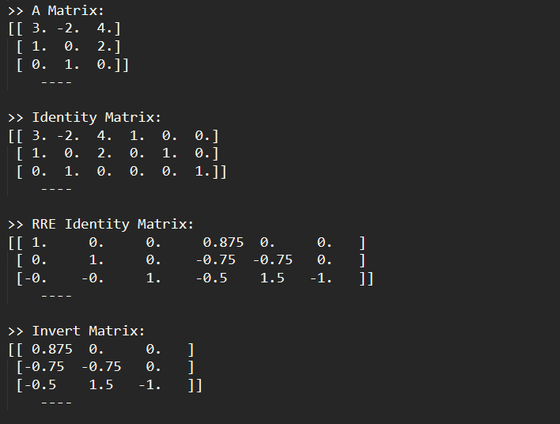

# How to inverse a matrix using NumPy

This is a simple script to do that. 

The inverse of a matrix is just a reciprocal of the matrix as we do in normal arithmetic for a single number which is used to solve the equations to find the value of unknown variables.   The inverse of a matrix is that matrix which when multiplied with the original matrix will give as an identity matrix.  The inverse of a matrix exists only if the matrix is non-singular i.e., determinant should not be 0. Using determinant and adjoint, we can easily find the inverse of a square matrix using below formula,
<pre>
if det(A) != 0
    A-1 = adj(A)/det(A)
else
    "Inverse doesn't exist"  
</pre>

#### Result

