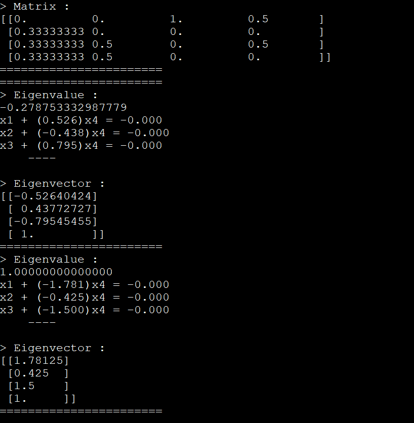

# Eigenvalue & Eigenvector

In this project, we used a graph data to create a matrix. The adjacency matrix of that graph. 
After that we find the eigenvalues and eigenvectors of that matrix.

## Result
<pre>
P1 P2
P1 P3
P1 P4
P2 P3
P2 P4
P3 P1
P4 P1
P4 P3
</pre>

