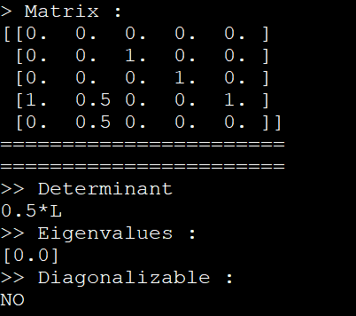

# Diagonalizable Matrix

With given a matrix, we check that if that matrix is diagonalizable or not. 
A <i>NxN</i> Matrix is diagonalizable if and only if it has N unique true eigenvalues.

## Result

