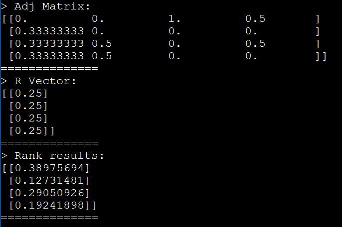

# Google Page Ranking

In this project, I represent <b>the google page ranking</b> algorithm. 
By a given data that is the adj matrix of webpages linking to each other we create the matrix
and we performe the google page ranking.

## Result
<pre>
P1 P2
P1 P3
P1 P4
P2 P3
P2 P4
P3 P1
P4 P1
P4 P3
</pre>

