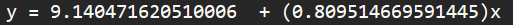
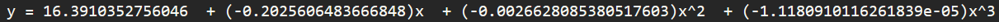

# Least Square

Fine the least square of a given data. (Display the line)

## Results
<pre>
2 10
6 2
5 4
0 0
12 10
9 9
13 4
15 12
19 20
22 90
40 92
46 93
50 67
52 66
53 50
55 23
56 9
57 18
</pre>

<pre>
1 12 3 4
1 4 18 5
19 20 22 56
22 12 0 1 8
17 19 0 1 9
56 4 23 2 10
12 55 43 2 10
1 11 3 10
2 4 17 50
29 40 52 5
3 1 10 1 18
13 12 10 1 9
57 4 23 2 19
11 5 3 21 100
</pre>
